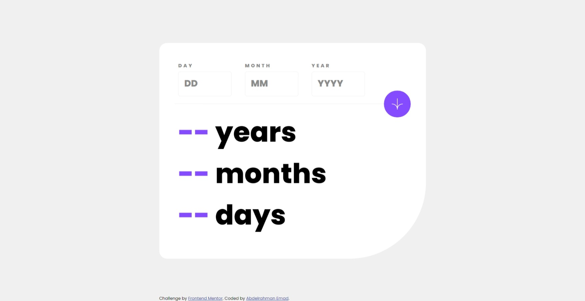

# Frontend Mentor - Age calculator app solution

This is a solution to the [Age calculator app challenge on Frontend Mentor](https://www.frontendmentor.io/challenges/age-calculator-app-dF9DFFpj-Q).

## Table of contents

- [Overview](#overview)
  - [The challenge](#the-challenge)
  - [Screenshot](#screenshot)
  - [Links](#links)
- [My process](#my-process)
  - [Built with](#built-with)
  - [What I learned](#what-i-learned)
  - [Continued development](#continued-development)
  - [Useful resources](#useful-resources)
- [Author](#author)

## Overview

### The challenge

to accomplish this challenge I have to be able to:

- View an age in years, months, and days after submitting a valid date through the form
- Receive validation errors if:
  - Any field is empty when the form is submitted
  - The day number is not between 1-31
  - The month number is not between 1-12
  - The year is in the future
- View the optimal layout for the interface depending on their device's screen size
- See hover and focus states for all interactive elements on the page
- **Bonus**: See the age numbers animate to their final number when the form is submitted

### Screenshot

### Links

- Live Site URL: [https://3omeed.github.io/age-calculator-app/](https://3omeed.github.io/age-calculator-app/)

## My process

### Built with

- Semantic HTML5 markup
- CSS custom properties
- Flexbox
- Mobile-first workflow
- JavaScript
- [Styled Components](https://styled-components.com/) - For styles

### What I learned

I learned to manage the if statement inside loops and how to make calculator for the age.
in javascript i am proud of the way of calculation, i figured two ways which was too hard to write as logic but the last way is more semantic and easier to understand

### Continued development

I still want to learn my fundamentals practice such as datastructure and algorithms, as long as I am learning
i also want to practice more on classes and advanced functions and array structure to help me improve my code and make it not just correct but also easy to read and understandable

### Useful resources

- [age calculator](https://www.agecalc.com) - This helped me as I make sure my answer is correct.
- [mdn](https://developer.mozilla.org/en-US/) - this help me understanding some methods and some built-in functions

## Author

- Website - [Abdelrahman Emad](https://www.linkedin.com/in/abdelrahman-emad-57bb10237/)
- Frontend Mentor - [@3omeed](https://www.frontendmentor.io/profile/3omeed)
